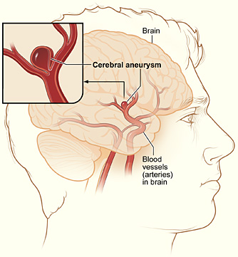
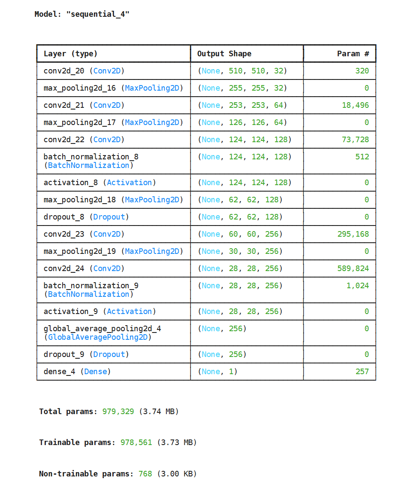
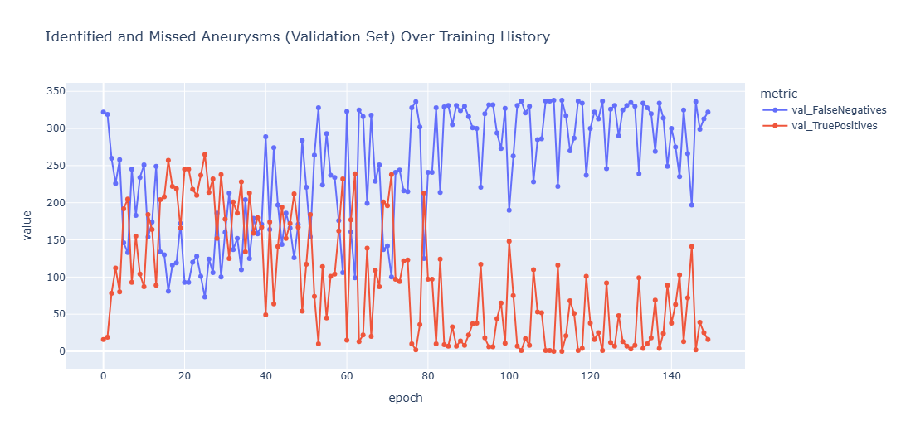

# Aneurysm Detection: Initial Class Report

### Project Structure

This file contains the initial/first report for my machine learning course. Please also note the following files:

- [Initial Report Notebook](initial_class_report.ipynb): contains the code for my initial report
- [Final Class Report](Final_Class_Report.md): contains the final report for my machine learning course
- [Final Class Report Notebook](final_class_report.ipynb): contains the code for my final class report
- [Competition Report](Competition_Report.md): fully up-to-date report on work for the competition (which closes on October 14th, 2025).
- [Competition Notebook](competition_notebook.ipynb): fully up-to-date code for competition

### Background

An intercranial aneurysm is an extremely dangerous condition that can be fatal if left untreated. Aneurysms can be detected through a variety of different kinds of medical imaging, but are not always noticed, particularly when they are not being actively looked for. Therefore, an algorithm that could be used to comb through medical images and reliably flag potential aneurysms that might otherwise be missed has the potential to be life-saving. However, training a machine learning algorithm to perform well at this task requires a high-quality dataset, which can be quite challenging to obtain.

To address this need, [Kaggle](https://www.kaggle.com/) and the [Radiological Society of North America (RSNA)](https://www.rsna.org/) jointly launched an open competition to detect intercranial aneurysms in medical images. Thanks to a huge list of data contributors and domain-expert data annotators who have meticulously labeled the dataset, this competition provides the best open-source dataset available for training an aneurysm detection algorithm to date.

For the competition homepage, see the following link: [https://www.kaggle.com/competitions/rsna-intracranial-aneurysm-detection/overview](https://www.kaggle.com/competitions/rsna-intracranial-aneurysm-detection/overview)

See also this excellent introductory article explaining the clinical problem in detail for non-medical people like me: [Overview of the Clinical Problem by Maria Correia de Verdier](https://www.kaggle.com/competitions/rsna-intracranial-aneurysm-detection/discussion/591648)

This is a competition with a $50,000 prize pool, but my goal is not to place very high in the competition or anything. This is my first major project of this type, so I am learning as I go. Also, the provided dataset is very large - it includes over 300 GB of medical images - and I don't have access to the computational resources to fully utilize it effectively, so I am mostly working off of a subset of the data that is more manageable for the computational resources I do have, which will inevitably impact my model's performance.

### Overview of the dataset

The dataset can be downloaded through the competition's [Dataset Description](https://www.kaggle.com/competitions/rsna-intracranial-aneurysm-detection/data) page. The download is a 200 GB zip file that when extracted is over 300 GB and contains over 1 million individual files, the vast majority of them `DICOM` files, which is a standard medical imaging format.

The root directory structure of the downloaded dataset looks like this:

- `series` (directory)
- `segmentations` (directory)
- `train.csv`
- `train_localizers.csv`

- The `series` folder contains 4,348 subdirectories, each corresponding to a single patient. Each of these subdirectories is labeled with a `SeriesInstanceUID` and contains a series of images of that particular patient.

- The `segmentations` folder contains `NifTI` segmentations of a subset of the `DICOM` series in the `series` folder. `NifTI` files are essentially a 3d medical imaging format. There is a cool `NifTI` file viewer tool at this link: [https://socr.umich.edu/HTML5/BrainViewer/](https://socr.umich.edu/HTML5/BrainViewer/). These segmentation files are not strictly necessary for building a functional model, and I do not use them at all for my initial baseline model. However, I would imagine that teams who figure out how to effectively incorporate these files into the learning process will be at an advantage.

I have excluded both the `series` and `segmentations` folders from this GitHub repository due to their prohibitive size. However, if you want to try out the BrainViewer link above, you can use the [nifti_example.nii](nifti_example.nii) file I included in the root of this directory (this is a couple of one of the files in the `segmentations` directory. It's pretty cool, I recommend trying it.

- `train.csv` is a table that contains 4,348 rows, 1 for each patient. Each rows contains a `SeriesInstanceUID` matching one of the subdirectories of the `series` folder. For each patient, this table then provides some basic demographic data (`PatientAge` and `PatientSex`), the modality of the medical images in their series folder (either `CTA`, `MRA`, `MRI T2`, or `MRI TIpost`), and whether there is an aneurysm present in any of 13 different locations in the brain. The 13 locations are:

- `Right Infraclinoid Internal Carotid Artery`
- `Left Supraclinoid Internal Carotid Artery`
- `Right Supraclinoid Internal Carotid Artery`
- `Left Middle Cerebral Artery`
- `Right Middle Cerebral Artery`
- `Anterior Communicating Artery`
- `Left Anterior Cerebral Artery`
- `Right Anterior Cerebral Artery`
- `Left Posterior Communicating Artery`
- `Right Posterior Communicating Artery`
- `Basilar Tip`
- `Other Posterior Circulation`

The final column, `Aneurysm Present`, is True (i.e. 1) if there is an aneurysm present *anywhere* in the brain, and False (i.e. 0) if that patient is fully aneurysm-free. About half of the 4,348 patients have at least 1 aneurysm, while the other half are aneurysm free.

- `train_localizers.csv` localizes the aneurysms to the specific image (`SOPInstanceUID`) within a patient's series of images in which an aneurysm is visible. It also pinpoints the location of the aneurysm, both to one of the 13 locations in the brain listed above, and to the x and y coordinates within the image itself.

Some DICOM image files are actually a series of images; in these cases, `train_localizers` also contains a frame value in which to find the suspect image frame within that specific file.

### Data Preparation

For the data preparation you are going to have to consult the [Jupyter notebook](notebook.ipynb). It required a lot of effort to convert this data into inputs that can be fed into a machine learning model. (My model will be a convolutional neural network defined using Keras).

### The Model

I went down a bit of a rabbit hole trying to design an initial model architecture. Consulting examples from various places online, especially lectures from Professor Josh Hug and the book Deep Learning with Python by Francois Chollet (which is available for free online [here](https://deeplearningwithpython.io/chapters/), I came up with the following initial architecture:

This is by no means ideal, there are undoubtedly many ways to improve this architecture, as it was just a first try. But I think it actually performed respectably for a first try, as seen below.

### Initial Model Performance

I trained my model using Google Colab on a NVIDIA A400 GPU (I tried using a T4 but the inputs exceeded the T4's 15 GB of VRAM). I created a graph of true positives and false negatives over the 150 epochs of training:

For this kind of task, correctly identifying true positives - or, equivalently, avoiding false negatives - is of paramount importance. The above graph shows true positives and false negatives for the initial model over the course of training, and presents a clear picture of the model's performance. The model rapidly improved its performance from epoch 0-16, and performed best between epochs 20 and 26. The best performance of the model by this metric was on epoch 25, where the model correctly identified 257 of the aneurysms in the validation dataset while missing only 75. This is a recall score of 78.4%. After this period of training, the model began to overfit. By epoch 77 the overfitting was very extreme, as the recall score would regularly go all the way down to the low single digits.

There is undoubtedly a great deal of room to improve on this model's performance. However, as a baseline first-try model, I am quite pleased - training definitely worked, and we now have a respectable baseline model to compare future changes against.

There is a lot of work to do to be competitive in the actual competition. Only half of the competition scoring comes from the `aneurysm_present` prediction. The other half comes from making predictions for where aneurysms are present out of 13 different regions of the brain, which I have not even tried to do yet in order to simplify the problem (this is my first time ever building a neural network, after all). That may require a fundamentally different data pipeline, so whether I will even try to work on that depends on how much time I have before the competition deadline to work on this project (the competition deadline is October 14th, or 11 days from when I am writing this). Which is alright; this project is way more about the learning experience for me than it is about trying to win the competition.